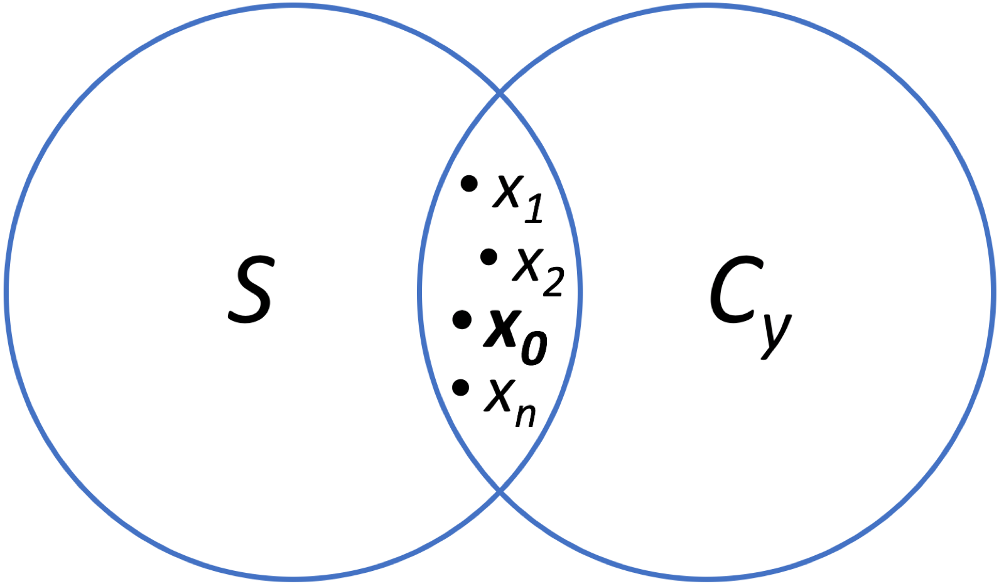
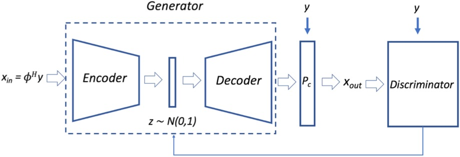

# GAN-Hallucination

## Background
The "hallucination" of realistic-looking artifacts is a major concern in the reconstruction of medical images, with the potential to mislead radiologists and result in bad patient outcomes. This project aims to provide a better understanding of the hallucination process through the implementation of a deep VAE-GAN model (in the VAE branch). The model learns a manifold of realistic images, and as the venn diagram below shows, intersecting this manifold with the subset of data consistent images (ensuring consistency with physical measurement) creates points corresponding to images with high likelihood of hallucination.

  

After training this model, its generative capabilities can be harnessed to generate new reconstructions (which lie in the intersection described above) that can be evaluated both visually and statistically. Future work will involve the development of regularization schemes to prevent hallucinations from occurring.
## Data
In training the model, we use a knee dataset obtained from patients at Stanford Hospital. Fully sampled images of size 320 by 256 are taken, downsampled, and then undersampled to provide inputs to the VAE-GAN model.

## Model Architecture
The model architecture is shown below, with the VAE (encoder and decoder layers are comprised of strided and transpose convolutions, respectively), a data consistency layer (affine projection), and discriminator (standard ConvNet).

## Command to Run From Terminal

python3  srez_main.py    
--run train     
--dataset_train Data/Knee-highresolution-19cases/train/   
--dataset_test Data/Knee-highresolution-19cases/test/
--sampling_pattern  Data/Knee-highresolution-19cases/sampling_pattern/mask_2fold_160_128_knee_vdrad.mat     
--sample_size 160   
--sample_size_y 128    
--batch_size 2     
--summary_period  20000      
--sample_test -1   
--sample_train -1     
--subsample_test 1000   
--subsample_train 1000 
--train_time 100   
--train_dir  results/
--checkpoint_dir  checkpoints/
--tensorboard_dir  tensorboard/
--gpu_memory_fraction 1.0  
--hybrid_disc 0    
--starting_batch 0
